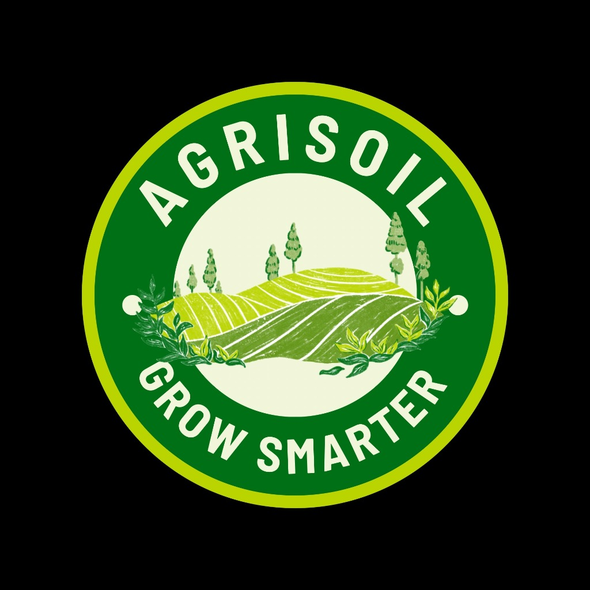

# 🌱 AGRISOIL - Grow Smarter

**IoT-Based Smart Irrigation Monitoring System**

---

## 📱 **Install the App**

### **On Android/iPhone:**
1. Open this page in **Chrome** or **Safari**
2. Tap the **menu** (⋮)
3. Select **"Add to Home screen"**
4. Tap **"Add"**
5. **AGRISOIL** app is now on your home screen! 🎉

---

## ✨ **Features**

- 🌱 **Real-time Soil Moisture** monitoring
- 🌡️ **Temperature & Humidity** tracking
- 💧 **Water Tank Level** display
- ⚙️ **Smart Pump Control** (auto & manual)
- 📅 **Harvest Timer** with countdown
- 📊 **History Charts** for data analysis
- 🎨 **Beautiful Green UI** with nature theme

---

## 🔧 **How It Works**

Connect to your ESP32 irrigation controller:
- Network: `AGRISOIL_WiFi`
- Access: `http://192.168.4.1`

Or use this demo version to see the UI!

---

## 💡 **About**

AGRISOIL is an IoT-based automated irrigation system designed to help farmers and gardeners monitor their crops smarter.

**Created by:** [Your Name]  
**Project:** Capstone Project 2026  
**License:** MIT

---

## 🚀 **Try it Now!**

[**Open AGRISOIL App →**](mobile-standalone.html)

Or scan this QR code:

*(QR code would go here)*

---

**Grow Smarter with AGRISOIL** 🌱✨
